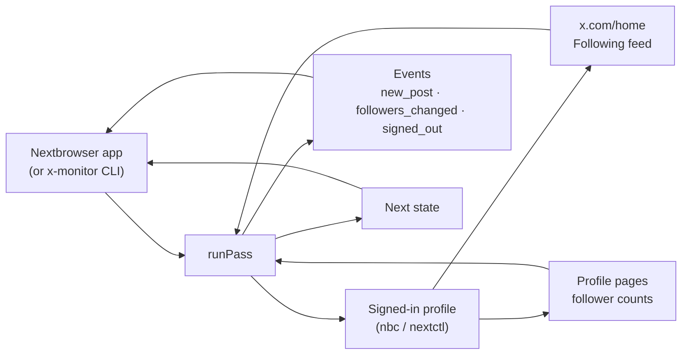

<p align="center">
  
</p>

<h1 align="center">Nextbrowser X Monitoring</h1>

<p align="center">
  <strong>The open-source X monitoring engine for Nextbrowser: new posts from the accounts you follow and changes in follower counts, read from your own signed-in browser profile.</strong>
</p>

<p align="center">
  <a href="https://nextbrowser.com/">Website</a> ·
  <a href="https://github.com/nextbrowser-oss/nextbrowser-app">Nextbrowser app</a> ·
  <a href="https://docs.nextbrowser.com/">Product docs</a> ·
  <a href="docs/how-it-works.md">How it works</a> ·
  <a href="https://discord.com/invite/gHXEvkGXnz">Discord</a>
</p>

<p align="center">
  <a href="https://github.com/nextbrowser-oss/nextbrowser-x-monitoring/actions/workflows/ci.yml"></a>
  <a href="LICENSE"></a>
  
  
  <a href="https://github.com/nextbrowser-oss/nextbrowser-app"></a>
</p>

<p align="center">
  English ·
  <a href="docs/i18n/ru/README.md">Русский</a>
</p>

<p align="center">
  
</p>

## Why Nextbrowser X Monitoring

This package is the engine behind X monitoring in [Nextbrowser](https://github.com/nextbrowser-oss/nextbrowser-app). It runs inside the app, on a browser profile you have already signed in to x.com, and it reports two things without keeping a tab open all day:

- what the people you follow just posted;
- whether an account is gaining or losing followers.

It is open source because it works with your own account. Anyone can read exactly which pages it opens, what it reads from them, and what it never touches.

- **Read-only.** It never follows, likes, replies, or rings a bell. The only click is the feed's own *Following* tab.
- **One page load for the whole feed.** It reads the chronological *Following* feed on the home page instead of visiting every followed profile.
- **Proxy-traffic aware.** It scrolls only as far as the last pass reached, reads profiles on their own schedule, and leaves the tab on `about:blank` between passes.
- **Owned by the app.** The engine keeps no timers, files, or network connections of its own. Nextbrowser runs a pass, stores the state, and decides what to show.

## Key features

| Area | What is available |
| --- | --- |
| New posts | Posts and replies from followed accounts, oldest first, with text, media counts, quoted post, and a link. Reposts are optional. |
| Follower counts | The signed-in account plus up to 50 other handles. Exact figures when the page holds them, x.com's rounded ones otherwise, labelled as such. |
| Session state | `signed_in`, `signed_out`, and `account_changed` events. A page x.com failed to draw is reported as a page failure, not as a sign-out. |
| Both front ends | Reads the classic signed-in x.com and the rewritten one that has no test ids. |
| Embeddable core | `runPass(state) → { state, events, summary }`, with no Node dependency, so it runs in the Nextbrowser renderer. |
| Standalone CLI | `x-monitor` drives any Nextbrowser profile through `nbc`/`nextctl`, for development and for running without the app. |

## In Nextbrowser

Nextbrowser ships the engine as a dependency and gives it three things:

- the browser it already drives for the selected profile;
- a place to keep the state;
- a timer.

```ts
import { normalizeState, runPass, scheduleDelay } from "@nextbrowser-oss/x-monitoring";

const { state, events, summary } = await runPass({
  browser: cliBrowser(profileArgs),          // the app's nextctl-backed browser for the profile
  state: normalizeState(await load()),       // whatever was saved last time, or nothing
  onEvent: (event) => notify(event),         // new_post, followers_changed, signed_out, ...
});
await save(state);
setTimeout(next, scheduleDelay(5 * 60_000, { loginRequired: summary.loginRequired }));
```

The [integration guide](docs/integration.md) describes the contract between the app and the engine.

## Run it standalone

To develop the engine, or to run it without the app, use the bundled CLI. You need Node.js 22 or later and a Nextbrowser profile that is signed in to x.com. The CLI uses the `nextctl` binary managed by the app, or `nbc` from your `PATH`.

```bash
git clone https://github.com/nextbrowser-oss/nextbrowser-x-monitoring.git
cd nextbrowser-x-monitoring
npm ci
npm run build
node dist/node/bin.js run --profile <your-profile> --followers <handle1>,<handle2>
```

What to expect:

1. The first pass records the current feed as a starting line and announces nothing.
2. Each later pass prints new posts and follower changes as they happen, then waits about five minutes (`--interval`).
3. Stop it with <kbd>Ctrl</kbd>+<kbd>C</kbd>. The next run continues from the saved state in `~/.nextbrowser/x-monitoring/<profile>.json`.

When you pipe the output to another program, it switches to JSON lines, one event per line. The [CLI reference](docs/cli-reference.md) lists every flag.

## How it works



Every pass does four things in order:

1. It checks who is signed in.
2. It reads the *Following* feed down to where the last pass stopped.
3. It reads the follower counts that are due.
4. It parks the tab.

The [how it works](docs/how-it-works.md) page explains the details:

- how a post is judged new;
- how reposts and replies are handled;
- how exact follower counts are read on both front ends of x.com;
- why each of those rules exists.

## Documentation

- [How it works](docs/how-it-works.md): the pass step by step, freshness rules, follower counts, both x.com front ends.
- [Integration guide](docs/integration.md): the contract with the Nextbrowser app, the Node adapter, installing the package.
- [Events and state](docs/events-and-state.md): every event, the state document, and the settings.
- [CLI reference](docs/cli-reference.md): `x-monitor` commands, flags, output, and exit codes.
- [Troubleshooting](docs/troubleshooting.md): a sign-out that is not one, a missing *Following* tab, profiles that will not start.

## Project status

This is an early release (`0.x`). Known limits:

- **Signed-in reads not yet verified live.** The page scripts were verified against live x.com while signed out, which serves the rewritten front end. The classic signed-in front end is covered by fixtures built from selectors proven in production by the Nextbrowser X reply agent. Three signed-in reads have not yet been confirmed on a live account: the *Following* tab, repost attribution, and exact counts read from React props.
- **Tab labels by language.** The *Following* tab is found by its label in about fifteen languages. In any other language, the second tab is assumed.
- **Counts only.** It tracks how many followers an account has, not which accounts followed or unfollowed.

Proposals and bugs go to [GitHub Issues](https://github.com/nextbrowser-oss/nextbrowser-x-monitoring/issues). An issue is a proposal, not a release commitment.

## Contributing

Read [CONTRIBUTING.md](CONTRIBUTING.md) before opening a change. Keep changes focused. For any change that affects what gets read from x.com, include tests against the fixture documents. A README change must also update the [Russian edition](docs/i18n/ru/README.md).

## Community and support

- Join the [Nextbrowser Discord](https://discord.com/invite/gHXEvkGXnz) for community chat, setup help, and product updates.
- Ask general questions in [Nextbrowser Discussions](https://github.com/nextbrowser-oss/nextbrowser-app/discussions).
- Use [GitHub Issues](https://github.com/nextbrowser-oss/nextbrowser-x-monitoring/issues) for actionable, scoped work.
- Follow [SECURITY.md](SECURITY.md) for private vulnerability reporting. Do not publish security details in an issue.

## Responsible use

Monitor only accounts you own or are authorized to operate, and follow [X's rules and terms](https://x.com/en/tos). The monitor paces itself on purpose:

- at least one minute between passes, with a random spread;
- at least five minutes between reads of the same profile;
- a cap of 50 tracked handles.

Do not remove these limits to scrape at scale.

## License

Nextbrowser X Monitoring is open-source software available under the [GNU Affero General Public License v3.0 only](LICENSE).

AGPL-3.0 permits commercial use, modification, and redistribution. If you distribute a modified version or run it as a network service, the license requires you to offer the corresponding source code under the same license. This repository's dependencies remain under their respective licenses.

Copyright © 2026 Nextbrowser contributors.
