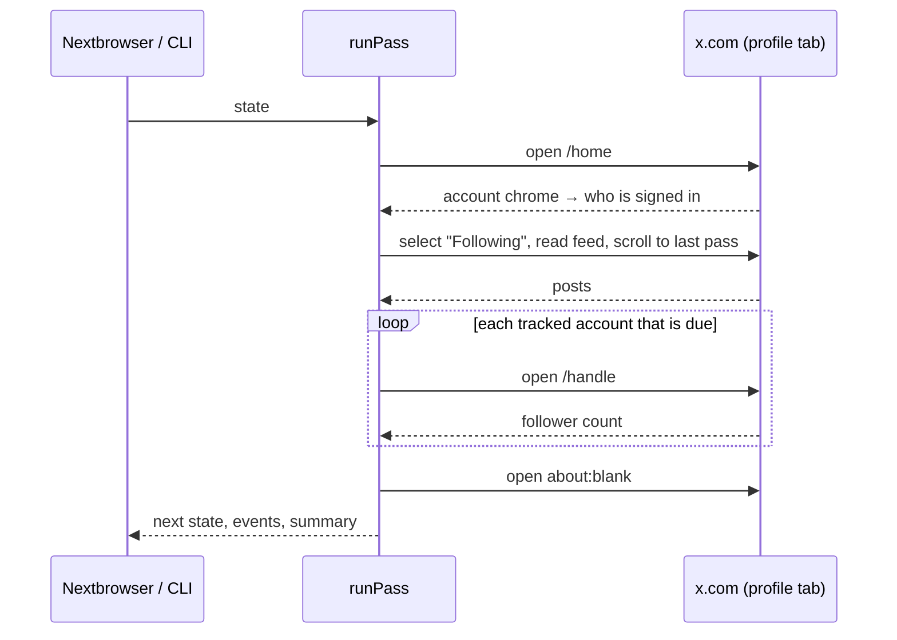

# How it works

A **pass** is one look at x.com through a signed-in Nextbrowser profile. It takes the saved state in and returns the next state, the events, and a summary. It never changes the state it was given. A pass that is stopped or crashes halfway therefore leaves the last saved state intact, and a pass that finishes returns everything it learned.

The pass itself never waits longer than one scroll. When the next pass runs is up to the caller: the Nextbrowser app or the CLI.

## 1. Account

The pass opens `https://x.com/home` and waits until x.com has drawn something. Then it reads who is signed in from the account chrome: the account switcher, the profile link, and the side navigation. It never reads identity from posts, because every post carries an avatar and those belong to other people.

| What the page shows | What the pass does |
| --- | --- |
| The sign-in gate (`/i/flow/login`, `redirect_after_login`, a username field) | Emits `signed_out` once, sets `loginRequired`, and reads nothing else. |
| x.com's error screen, or a blank page, even in a fresh tab | Reports a page failure in `summary.blocked`. This is **not** a sign-out. |
| A signed-in account | Continues. The first pass, and the first pass after a sign-out, emit `signed_in`. |
| A different account than last time | Emits `account_changed`. The feed starts over, because another account follows other people. |

A blank page and a signed-out page look the same to a script that only checks for the account chrome. Treating a blank page as a sign-out asks someone to sign in again when they never signed out. So a page that did not render is first reopened in a fresh tab: a tab where x.com's app has failed keeps failing on every reload, while a new tab loads normally. Only a page that still shows nothing after that is reported, as a page failure.

## 2. The Following feed

The home page has two feeds: *For you*, which is ranked, and *Following*, which is chronological and contains only the accounts the profile follows. The pass selects *Following*, preferring a real mouse click when the browser supports one. x.com remembers the choice, so from the second pass on this step is a single read.

The tab is recognised by its label in about fifteen languages. In any other language the pass uses the second tab, because *For you* is always first.

### Reading down to the last pass

Posts are read top to bottom, newest first, from both front ends of x.com (see below). The pass scrolls until one of these happens:

- it has passed **three posts it already knew**;
- it reaches `feedLimit` entries, or `maxScrolls` scrolls;
- three scrolls in a row bring nothing new.

One known post is not enough to stop, because x.com draws the post a reply answers *above* the reply, and that post is often old.

The first read of a feed does not scroll. It records what is on screen as the starting line and announces none of it.

### What counts as new

| Entry | New when |
| --- | --- |
| An original post or reply | Its id is newer than the newest post of the last pass, it has not been seen before, and it is not older than `maxPostAgeMs`. |
| A repost (only with `includeReposts`) | It has not been seen before, and it appears above the first post the last pass saw. A repost carries the original post's id, which says nothing about when it was reposted, so its position in the feed is the only clue. |
| An ad | Never. |
| The account's own post or repost | Never. It is not news to the account. |

Post ids are snowflakes. They grow with time and are wider than a JavaScript number can hold exactly, so ids are compared as digit strings and never converted to numbers. The pass keeps the last 2,000 entry keys it has seen and the newest id.

New posts are emitted oldest first, as `new_post` events. If a read never got back to ground the last pass covered, the pass sets `summary.gap` and adds a note, because posts between the two reads may have been missed.

### After a long absence

A laptop that slept through the night comes back to a feed it has not seen for hours. `maxPostAgeMs` (6 hours by default) keeps it from reporting all of those hours as fresh news.

## 3. Follower counts

The pass tracks the signed-in account, when `trackOwnFollowers` is on, and every handle in `followerHandles`. It reads one account only when that account is due, which by default is every 30 minutes. With `followersIntervalMs: 0` it reads them on every pass, which is what Nextbrowser does, since its schedule already sets how often a pass runs. It pauses a few seconds between profile pages.

x.com draws counts rounded above ten thousand ("12.3K", "92,3 млн"), so the exact figure is looked for first:

| Where | Front end | Exact |
| --- | --- | --- |
| The router's loader data (`window.__TSR_ROUTER__`) | rewritten x.com | yes |
| The user object in the props of the components that draw the profile header | classic x.com | yes |
| The drawn label, e.g. "1,234 Followers", "12.3K", "1,2 Mio.", "12万" | both | only below 10K |

When the pass has only the rounded label, the event carries `exact: false`: the delta is then only as good as the rounding. A change from a rounded figure to an exact one (or back) is recorded without an event, because it reflects how the figure was read, not a real change in followers.

A profile that could not be read gets a note, for example "suspended or deleted". The pass retries it after 10 minutes rather than on every pass.

## 4. Parking the tab

Once the reads are done, the pass opens `about:blank`. A feed left on screen keeps autoplaying video and polling x.com. When the Nextbrowser X reply agent ran in production, that idle page cost more proxy traffic than the reads themselves. Set `parkTab: false` to keep the page.

## Two front ends of x.com

x.com currently serves two front ends:

- **Classic.** The signed-in site, with a `data-testid` on almost everything, `<time>` elements, and React props that carry the full user object.
- **Rewritten.** The signed-out site, verified live on 2026-09-25. It has no test ids and no `<time>`. Relative times ("9h") are drawn as plain text, and the profile's exact counts sit in the router's loader data.

Every read tries the classic markup first and then falls back to what both front ends share:

- `<article>` elements, and permalinks of the form `/handle/status/id`;
- a post's creation time from its snowflake id, when there is no `<time>`;
- the post text from the `whitespace-pre-wrap` block of the rewritten front end.

The scripts are tested against sample documents of both front ends in [`src/scripts.test.ts`](../src/scripts.test.ts).

## What it never does

The engine only reads. It never follows or unfollows, likes, reposts, replies, or turns on notifications, and it never types anything into x.com. Its only interaction with a page is selecting the *Following* tab and scrolling the feed. It keeps no network connections, timers, or files of its own: everything goes through the browser and the state it is handed.
