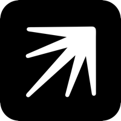
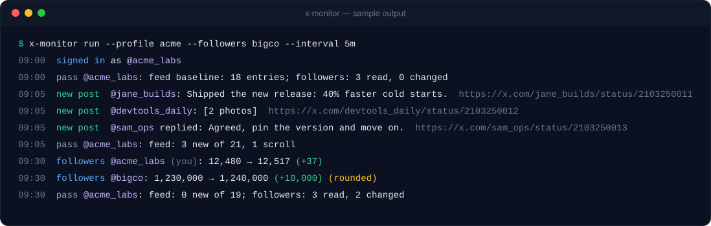
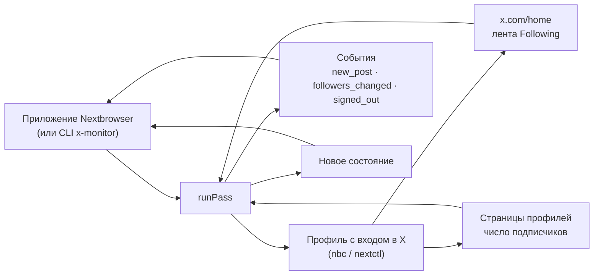

<p align="center">
  
</p>

<h1 align="center">Nextbrowser X Monitoring</h1>

<p align="center">
  <strong>Открытый движок мониторинга X для Nextbrowser: новые посты аккаунтов, на которые вы подписаны, и изменения числа подписчиков — прямо из вашего браузерного профиля, в котором выполнен вход.</strong>
</p>

<p align="center">
  <a href="https://nextbrowser.com/">Сайт</a> ·
  <a href="https://github.com/nextbrowser-oss/nextbrowser-app">Приложение Nextbrowser</a> ·
  <a href="https://docs.nextbrowser.com/">Документация продукта</a> ·
  <a href="../../how-it-works.md">Как это работает</a> ·
  <a href="https://discord.com/invite/gHXEvkGXnz">Discord</a>
</p>

<p align="center">
  <a href="https://github.com/nextbrowser-oss/nextbrowser-x-monitoring/actions/workflows/ci.yml"></a>
  <a href="../../../LICENSE"></a>
  
  
  <a href="https://github.com/nextbrowser-oss/nextbrowser-app"></a>
</p>

<p align="center">
  <a href="../../../README.md">English</a> ·
  Русский
</p>

<p align="center">
  
</p>

## Зачем нужен Nextbrowser X Monitoring

Этот пакет — движок, на котором работает мониторинг X в [Nextbrowser](https://github.com/nextbrowser-oss/nextbrowser-app). Он работает внутри приложения, в браузерном профиле, где вы уже вошли в x.com. Держать вкладку открытой весь день не нужно — он сам сообщает о двух вещах:

- что только что опубликовали те, на кого вы подписаны;
- растёт или падает число подписчиков у аккаунта.

Код открыт, потому что движок работает с вашим собственным аккаунтом. Любой может проверить, какие страницы он открывает, что на них читает и чего никогда не делает.

- **Только чтение.** Движок не подписывается, не лайкает, не отвечает и не включает уведомления. Единственный клик — по вкладке *Following* в самой ленте.
- **Вся лента за одну загрузку страницы.** Движок читает хронологическую ленту *Following* на главной, а не обходит профиль каждой подписки.
- **Бережёт прокси-трафик.** Лента прокручивается только до места, где остановился прошлый проход. Профили читаются по своему расписанию. Между проходами вкладка остаётся на `about:blank`.
- **Всем управляет приложение.** У движка нет своих таймеров, файлов и сетевых соединений. Проход запускает Nextbrowser, он же хранит состояние и решает, что показать.

## Возможности

| Область | Что есть |
| --- | --- |
| Новые посты | Посты и ответы подписок, от старых к новым: текст, число фото и видео, цитируемый пост, ссылка. Репосты включаются отдельно. |
| Подписчики | Число подписчиков у вошедшего аккаунта и ещё до 50 хендлов. Где страница отдаёт точное число, берётся оно. Иначе берётся округлённое число x.com, и это явно помечается. |
| Сессия | События `signed_in`, `signed_out`, `account_changed`. Страница, которую x.com не отрисовал, считается сбоем страницы, а не выходом из аккаунта. |
| Оба фронтенда | Читает и классический x.com (для вошедших), и переписанный, где нет test id. |
| Встраиваемое ядро | `runPass(state) → { state, events, summary }`. Ядро не зависит от Node, поэтому работает в renderer-процессе Nextbrowser. |
| Отдельный CLI | `x-monitor` управляет любым профилем Nextbrowser через `nbc`/`nextctl`. Нужен для разработки и для запуска без приложения. |

## В Nextbrowser

Nextbrowser подключает движок как зависимость и передаёт ему три вещи:

- браузер, которым приложение уже управляет для выбранного профиля;
- место для хранения состояния;
- таймер.

```ts
import { normalizeState, runPass, scheduleDelay } from "@nextbrowser-oss/x-monitoring";

const { state, events, summary } = await runPass({
  browser: cliBrowser(profileArgs),          // браузер профиля из приложения, через nextctl
  state: normalizeState(await load()),       // сохранённое в прошлый раз состояние или ничего
  onEvent: (event) => notify(event),         // new_post, followers_changed, signed_out, ...
});
await save(state);
setTimeout(next, scheduleDelay(5 * 60_000, { loginRequired: summary.loginRequired }));
```

Как именно приложение и движок работают вместе, описано в [руководстве по интеграции](../../integration.md).

## Запуск без приложения

Для разработки движка или запуска без приложения есть встроенный CLI. Нужны Node.js 22+ и профиль Nextbrowser, в котором выполнен вход в x.com. CLI берёт `nextctl`, установленный приложением, а если его нет — `nbc` из `PATH`.

```bash
git clone https://github.com/nextbrowser-oss/nextbrowser-x-monitoring.git
cd nextbrowser-x-monitoring
npm ci
npm run build
node dist/node/bin.js run --profile <ваш-профиль> --followers <хендл1>,<хендл2>
```

Как проходит запуск:

1. Первый проход запоминает текущую ленту как точку отсчёта и ни о чём не сообщает.
2. Следующие проходы выводят новые посты и изменения числа подписчиков по мере появления. Между проходами — около пяти минут (`--interval`).
3. Остановить — <kbd>Ctrl</kbd>+<kbd>C</kbd>. Следующий запуск продолжит с состояния, сохранённого в `~/.nextbrowser/x-monitoring/<профиль>.json`.

Если перенаправить вывод в другую программу, CLI переключится на JSON Lines: одно событие на строку. Все флаги описаны в [справочнике CLI](../../cli-reference.md).

## Как это работает



Каждый проход делает четыре шага по порядку:

1. Определяет, кто вошёл в аккаунт.
2. Читает ленту *Following* до места, где остановился прошлый проход.
3. Читает число подписчиков у тех аккаунтов, которым подошёл срок.
4. Переводит вкладку на `about:blank`.

Подробности — на странице [«Как это работает»](../../how-it-works.md):

- как решается, что пост новый;
- как обрабатываются репосты и ответы;
- как читаются точные числа подписчиков на обоих фронтендах x.com;
- зачем нужно каждое из этих правил.

## Документация

Документация пока только на английском.

- [How it works](../../how-it-works.md) — проход по шагам, правила новизны, подписчики, два фронтенда x.com.
- [Integration guide](../../integration.md) — как приложение Nextbrowser работает с движком, Node-адаптер, установка пакета.
- [Events and state](../../events-and-state.md) — все события, формат состояния, настройки.
- [CLI reference](../../cli-reference.md) — команды, флаги, вывод и коды выхода `x-monitor`.
- [Troubleshooting](../../troubleshooting.md) — «выход из аккаунта», который им не является, пропавшая вкладка *Following*, профили, которые не стартуют.

## Статус проекта

Это ранний релиз (`0.x`). Известные ограничения:

- **Чтение с вошедшего аккаунта ещё не проверено вживую.** Скрипты страниц проверены на живом x.com без входа — там отдаётся переписанный фронтенд. Классический фронтенд для вошедших покрыт фикстурами, собранными из селекторов, которые X reply agent Nextbrowser использует в продакшене. На живом аккаунте ещё не подтверждены три вещи: вкладка *Following*, определение автора репоста и точное число подписчиков из React-props.
- **Названия вкладок на разных языках.** Вкладка *Following* ищется по названию примерно на пятнадцати языках. Для остальных языков берётся вторая вкладка.
- **Только число подписчиков.** Движок отслеживает, сколько подписчиков у аккаунта, но не кто именно подписался или отписался.

Предложения и баги — в [GitHub Issues](https://github.com/nextbrowser-oss/nextbrowser-x-monitoring/issues). Issue — это предложение, а не обещание релиза.

## Участие в разработке

Перед изменениями прочитайте [CONTRIBUTING.md](../../../CONTRIBUTING.md). Делайте изменения сфокусированными. Если изменение влияет на то, что читается с x.com, добавьте тесты на фикстурах. Если меняете README, обновите и английскую, и русскую версию.

## Сообщество и поддержка

- [Discord Nextbrowser](https://discord.com/invite/gHXEvkGXnz) — общение, помощь с настройкой, новости продукта.
- Общие вопросы — в [Discussions Nextbrowser](https://github.com/nextbrowser-oss/nextbrowser-app/discussions).
- Конкретные задачи — в [GitHub Issues](https://github.com/nextbrowser-oss/nextbrowser-x-monitoring/issues).
- Об уязвимостях сообщайте приватно, как описано в [SECURITY.md](../../../SECURITY.md). Не публикуйте детали в issue.

## Ответственное использование

Мониторьте только свои аккаунты или те, которыми вам разрешено управлять, и соблюдайте [правила X](https://x.com/en/tos). Движок намеренно ограничивает частоту запросов:

- не чаще одного прохода в минуту, со случайным разбросом;
- не чаще одного чтения одного профиля в пять минут;
- не больше 50 отслеживаемых хендлов.

Не снимайте эти ограничения ради массового скрейпинга.

## Лицензия

Nextbrowser X Monitoring — открытое ПО под лицензией [GNU Affero General Public License v3.0 only](../../../LICENSE).

AGPL-3.0 разрешает коммерческое использование, изменение и распространение. Если вы распространяете изменённую версию или запускаете её как сетевой сервис, лицензия обязывает предоставить соответствующий исходный код на тех же условиях. Зависимости репозитория распространяются под своими лицензиями.

Copyright © 2026 Nextbrowser contributors.
